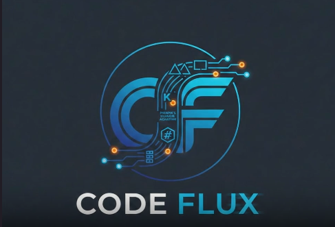
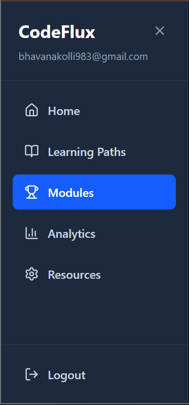
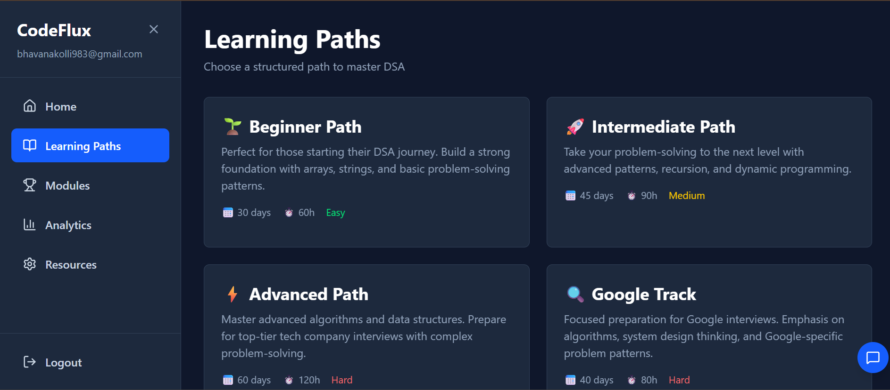
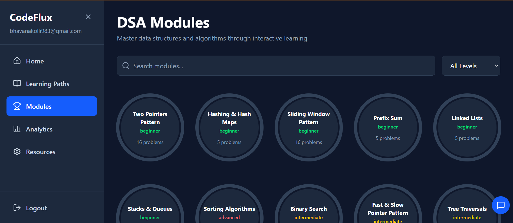
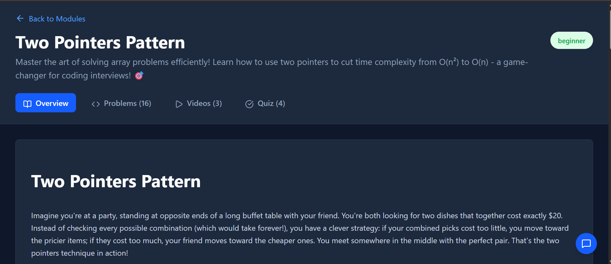
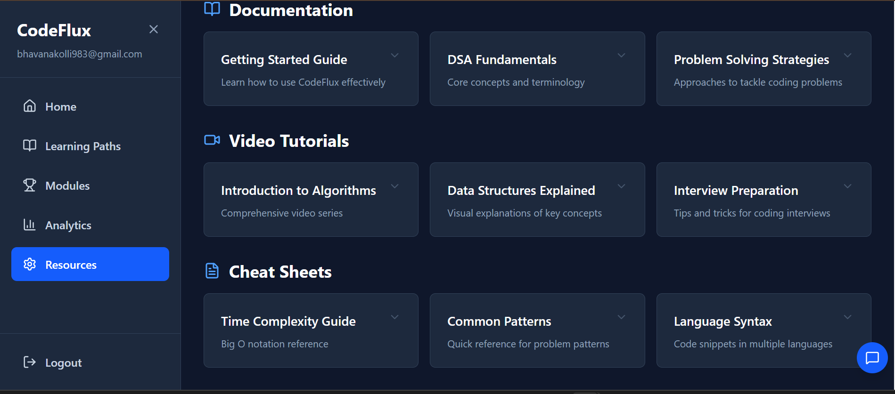
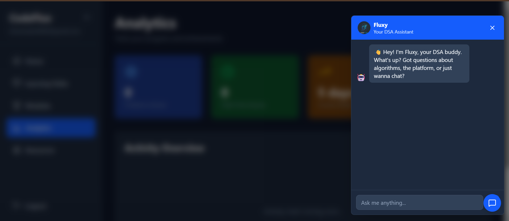

<div align="center">



# 🚀 CodeFlux

### Interactive DSA Learning Platform

**Learn • Practice • Analyze • Master**

A modern platform for mastering **Data Structures & Algorithms** through structured learning paths, interactive modules, visual explanations, quizzes, curated resources, and an intelligent AI learning assistant.

<p align="center">

<a href="https://codeflux-nu.vercel.app/">

</a>

<a href="https://github.com/bhavana2007/CodeFlux">

</a>

</p>

<p align="center">


</p>

</div>

---

# 📖 About CodeFlux

CodeFlux is an interactive DSA learning platform designed to make technical interview preparation engaging, structured, and beginner-friendly.

Instead of relying on scattered notes and random practice, learners follow organized learning paths, explore interactive modules, access curated learning resources, monitor their progress, and receive assistance from **Fluxy**, an AI-powered learning companion.

The project focuses on delivering a modern learning experience with an intuitive user interface and structured educational content.

---

# ✨ Features

## 🎯 Structured Learning Paths

Choose a roadmap based on your current skill level.

- 🌱 Beginner Path
- 🚀 Intermediate Path
- ⚡ Advanced Path
- 🔍 Google Interview Track

---

## 📚 Interactive DSA Modules

Master important coding interview patterns including:

- Arrays
- Strings
- Linked Lists
- Stacks & Queues
- Trees
- Graphs
- Binary Search
- Sorting Algorithms
- Sliding Window
- Prefix Sum
- Hash Maps
- Two Pointer Pattern
- Fast & Slow Pointer

Every module provides

- 📖 Beginner-friendly explanations
- 💻 Practice problems
- 🎥 Video tutorials
- 📝 Interactive quizzes
- 🎯 Difficulty classification

---

## 📘 Rich Learning Experience

Each module contains a dedicated learning page with

- Concept overview
- Pattern explanation
- Interview insights
- Practice questions
- Video learning resources
- Interactive quizzes

making the learning process engaging and structured.

---

## 📊 Progress Analytics

Track your DSA journey with

- Learning progress
- Completed modules
- Practice statistics
- Performance overview
- Personalized learning insights

---

## 📖 Curated Resources

Access everything needed for interview preparation from one place.

- Documentation
- Video Tutorials
- Cheat Sheets
- Time Complexity Guide
- Problem Solving Strategies
- Interview Preparation Notes

---

## 🤖 Fluxy AI Assistant

Fluxy is your learning companion inside CodeFlux.

It helps users by

- Answering DSA-related questions
- Explaining concepts
- Guiding learning paths
- Assisting platform navigation
- Making learning more interactive

---

# 📸 Application Screenshots

## 🏠 Dashboard

<p align="center">

</p>

---

## 🚀 Learning Paths

<p align="center">

</p>

---

## 📚 Interactive Modules

<p align="center">

</p>

---

## 📖 Module Learning Page

<p align="center">

</p>

---

## 📚 Learning Resources

<p align="center">

</p>

---

## 🤖 Fluxy AI Assistant

<p align="center">

</p>

---

# 🛠️ Tech Stack

| Category | Technologies |
|-----------|--------------|
| Frontend | React, Vite |
| Styling | Tailwind CSS |
| Language | JavaScript |
| Routing | React Router |
| Icons | Lucide React |
| Build Tool | Vite |

---

# 📂 Project Structure

```text
CodeFlux
│
├── assets
│   ├── logo
│   └── screenshots
│
├── public
├── src
│   ├── components
│   ├── pages
│   ├── hooks
│   ├── utils
│   └── assets
│
├── tests
├── package.json
└── README.md
```

---

# 🚀 Getting Started

### Clone the Repository

```bash
git clone https://github.com/bhavana2007/CodeFlux.git
```

### Navigate to the Project

```bash
cd CodeFlux
```

### Install Dependencies

```bash
npm install
```

### Start Development Server

```bash
npm run dev
```

The application will run on:

```
http://localhost:5173
```

---

# 🌟 Highlights

- Modern Responsive UI
- Component-Based Architecture
- Structured DSA Learning
- Interactive Educational Content
- AI Learning Assistant
- Beginner-Friendly Experience
- Clean & Scalable Codebase
- Optimized User Experience

---

# 🚀 Future Enhancements

- Daily Coding Challenges
- Leaderboards
- Gamification & Achievements
- User Authentication
- Cloud Progress Sync
- AI-generated Learning Roadmaps
- Mock Coding Interviews
- Company-wise Interview Questions
- Notes & Bookmarking
- Dark / Light Theme

---

# 👩‍💻 Developer

**Bhavana Kolli**

AI & Machine Learning Student

📧 bhavanakolli983@gmail.com

🔗 LinkedIn  
https://www.linkedin.com/in/bhavana-kolli-020b35368/

🐙 GitHub  
https://github.com/bhavana2007

---

<div align="center">

### ⭐ If you found CodeFlux useful, don't forget to give it a Star!

**Made with ❤️ by Bhavana Kolli**

</div>
